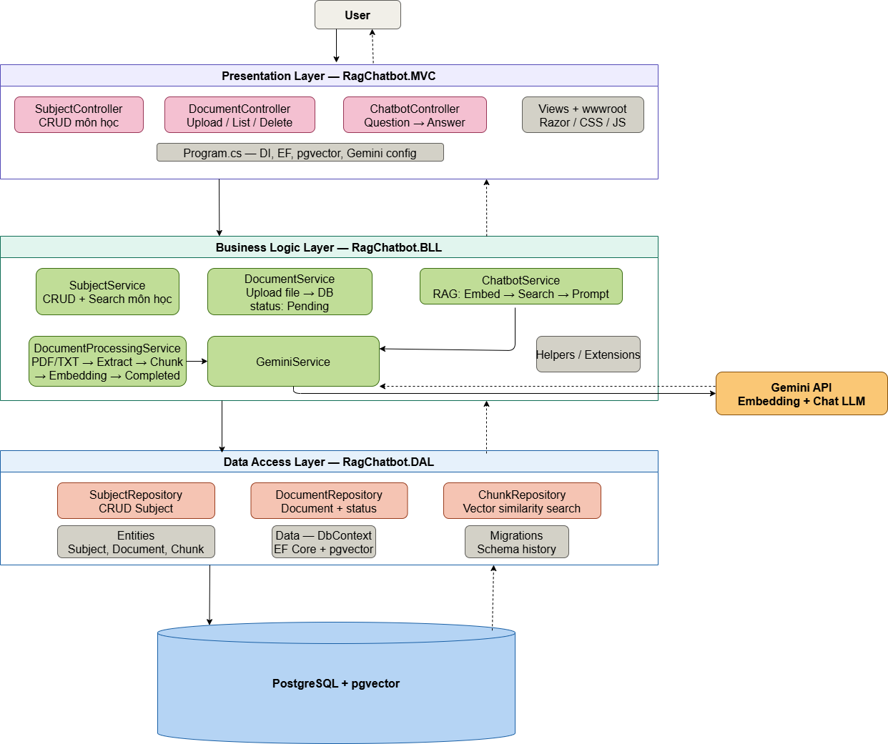

# 🎓 EduChatbot — AI-Powered Learning Platform

<div align="center">


**Hệ thống quản lý môn học & chatbot thông minh sử dụng công nghệ RAG (Retrieval-Augmented Generation)**

</div>

---

## 📋 Mục lục

- [Giới thiệu](#-giới-thiệu)
- [Tính năng nổi bật](#-tính-năng-nổi-bật)
- [Kiến trúc hệ thống](#-kiến-trúc-hệ-thống)
- [Công nghệ sử dụng](#-công-nghệ-sử-dụng)
- [Cài đặt & Chạy dự án](#-cài-đặt--chạy-dự-án)
- [Cấu trúc dự án](#-cấu-trúc-dự-án)
- [Phân quyền người dùng](#-phân-quyền-người-dùng)
- [Hướng dẫn sử dụng](#-hướng-dẫn-sử-dụng)
- [Tài khoản mặc định](#-tài-khoản-mặc-định)
- [Lưu ý](#-lưu-ý)

---

## 🌟 Giới thiệu

**EduChatbot** là một ứng dụng web giáo dục được xây dựng trên nền tảng **ASP.NET Core 9 MVC**, tích hợp trí tuệ nhân tạo thông qua **Google Gemini API** với công nghệ **RAG (Retrieval-Augmented Generation)**.

Hệ thống cho phép giảng viên tải lên tài liệu học tập (PDF, DOCX, TXT), sau đó AI sẽ tự động đọc, phân tích và lập chỉ mục nội dung theo phương pháp **Semantic Chunking**. Sinh viên có thể đặt câu hỏi trực tiếp với AI và nhận được câu trả lời chính xác dựa trên nội dung tài liệu của môn học.

### Luồng hoạt động RAG

```
Tài liệu (PDF / DOCX / TXT)
            │
            ▼
   Trích xuất văn bản
   PdfPig (PDF) · OpenXml (DOCX) · System.IO (TXT)
            │
            ▼
     Semantic Chunking          ← Chia tại ranh giới câu/đoạn văn
     ~400 từ / chunk            ← Không bao giờ cắt giữa câu
     Overlap 2 câu              ← Giữ ngữ cảnh kết nối
            │
            ▼
     Google Gemini API
     Tạo vector embedding
     (768 chiều)
            │
            ▼
    Lưu vào PostgreSQL
      + pgvector
            │
            ▼
        [Khi chat]
            │
            ▼
     Câu hỏi → Embedding
            │
            ▼
     Cosine Similarity Search
     → Top 3 đoạn liên quan
            │
            ▼
     Gemini GenerateContent
     (prompt + context)
            │
            ▼
          Trả lời
```

---

## ✨ Tính năng nổi bật

### 🤖 AI & RAG
- Tự động đọc và học nội dung tài liệu **PDF, DOCX, TXT**
- **Semantic Chunking**: chia văn bản theo ranh giới câu/đoạn văn — không cắt giữa câu
- Tìm kiếm ngữ nghĩa (semantic search) bằng vector embedding 768 chiều
- Chatbot trả lời dựa trên nội dung tài liệu môn học
- **Chunk Viewer**: xem trực tiếp từng chunk AI đã học, số từ, thống kê
- Sử dụng mô hình `gemini-2.5-flash` và `gemini-embedding-001`

### 📚 Quản lý học tập
- Quản lý môn học (tạo, sửa, xóa)
- Upload và quản lý tài liệu môn học
- **Chống trùng file**: mỗi môn học không cho phép upload 2 file trùng tên
- Xem tài liệu PDF trực tiếp trên trình duyệt
- Tải tài liệu về máy

### 👥 Quản lý người dùng & phân quyền
- Phân quyền 3 cấp: **Admin**, **Giảng viên**, **Sinh viên**
- Admin tạo tài khoản và tự động gửi thông tin đăng nhập qua Gmail
- Admin xóa tài khoản (không thể tự xóa chính mình)
- Admin & Giảng viên gán thành viên vào môn học (chọn nhiều người cùng lúc)
- **Giới hạn giảng viên**: tối đa **3 Giảng viên/Admin** trên mỗi môn học
- Giảng viên chỉ thêm được Sinh viên vào môn học của mình

### 🔐 Bảo mật & Tài khoản
- Đăng nhập bằng Cookie Authentication
- **Quên mật khẩu**: nhận link đặt lại qua Gmail, có hiệu lực **30 phút**
- Link reset single-use (bị hủy ngay sau khi sử dụng)
- Gmail bắt buộc khi tạo tài khoản — dùng để nhận thông tin và reset mật khẩu

### 📧 Email tự động (Gmail SMTP)
- Gửi thông tin tài khoản & mật khẩu khi admin tạo mới
- Gửi link đặt lại mật khẩu khi người dùng quên mật khẩu
- Email hiển thị tên admin gửi, Reply-To trỏ về Gmail admin

### 🎨 Giao diện
- Sidebar navigation hiện đại, responsive
- Card layout cho danh sách môn học
- **Toast notification**: mọi thao tác thêm/sửa/xóa đều hiển thị thông báo SweetAlert2 góc trên phải (thành công / cảnh báo / lỗi), tự tắt sau 4 giây
- Chào người dùng bằng họ tên đầy đủ
- Đồng hồ đếm ngược 30 phút trên trang đặt lại mật khẩu

---

## 🏗️ Kiến trúc hệ thống

Dự án tuân theo kiến trúc **3-Layer** nghiêm ngặt và đã được kiểm tra (audit):



---

## 🛠️ Công nghệ sử dụng

| Thành phần | Công nghệ |
|---|---|
| **Framework** | ASP.NET Core 9 MVC |
| **ORM** | Entity Framework Core 9 |
| **Database** | PostgreSQL 18 |
| **Vector Store** | pgvector |
| **AI Model** | Google Gemini 2.5 Flash |
| **Embedding** | Google Gemini Embedding-001 (768 dim) |
| **PDF Parser** | PdfPig 0.1.14 |
| **DOCX Parser** | DocumentFormat.OpenXml 3.5.1 |
| **Authentication** | ASP.NET Cookie Authentication |
| **Email** | Gmail SMTP (System.Net.Mail) |
| **Frontend** | Bootstrap 5, Bootstrap Icons |
| **Alert / Toast** | SweetAlert2 |

---

## 🚀 Cài đặt & Chạy dự án

### Yêu cầu

- [.NET SDK 9.0+](https://dotnet.microsoft.com/download/dotnet/9.0)
- [PostgreSQL 14+](https://www.postgresql.org/download/) với extension **pgvector**
- Google Gemini API Key ([lấy tại đây](https://aistudio.google.com/app/apikey))
- Gmail + App Password (để gửi email)

### Các bước cài đặt

**1. Clone dự án**
```bash
git clone https://github.com/your-username/PRN222-Assiment1.git
cd PRN222-Assiment1
```

**2. Cấu hình appsettings**

Tạo file `RagChatbot.MVC/appsettings.json` (không được commit):
```json
{
  "ConnectionStrings": {
    "DefaultConnection": "Host=localhost;Port=5432;Database=RagChatbotDB;Username=YOUR_USER;Password=YOUR_PASSWORD"
  },
  "Gemini": {
    "ApiKey": "YOUR_GEMINI_API_KEY"
  },
  "Smtp": {
    "Host": "smtp.gmail.com",
    "Port": "587",
    "Username": "your-gmail@gmail.com",
    "Password": "xxxx xxxx xxxx xxxx",
    "FromName": "EduChatbot"
  }
}
```

> **Lấy Gmail App Password:** Vào [myaccount.google.com](https://myaccount.google.com) → Bảo mật → Bật Xác minh 2 bước → Mật khẩu ứng dụng → Tạo mới

**3. Cài pgvector cho PostgreSQL**
```sql
CREATE EXTENSION IF NOT EXISTS vector;
```

**4. Chạy migration để tạo database**
```bash
dotnet ef database update --project RagChatbot.DAL --startup-project RagChatbot.MVC
```

**5. Chạy ứng dụng**
```bash
cd RagChatbot.MVC
dotnet run
```

Truy cập: `https://localhost:5001` hoặc `http://localhost:5000`

---

## 📁 Cấu trúc dự án

```
PRN222-Assiment1/
│
├── RagChatbot.DAL/                         # Data Access Layer
│   ├── Data/
│   │   └── ApplicationDbContext.cs         # EF Core DbContext + Seed data
│   ├── Entities/                           # Database entities (không expose ra ngoài DAL)
│   │   ├── User.cs                         # Id, Username, Password, Role, FullName, Email, ResetToken
│   │   ├── Subject.cs
│   │   ├── Document.cs
│   │   ├── DocumentChunk.cs                # TextContent + Embedding (Vector 768 dim)
│   │   ├── DocumentStatus.cs
│   │   └── UserSubject.cs                  # Quan hệ nhiều-nhiều User ↔ Subject
│   ├── Repositories/
│   │   ├── Interfaces/
│   │   │   ├── IUserRepository.cs
│   │   │   ├── ISubjectRepository.cs
│   │   │   ├── IDocumentRepository.cs      # Bao gồm ExistsByFileName
│   │   │   ├── IDocumentChunkRepository.cs # Bao gồm SearchSimilarChunksAsync (pgvector)
│   │   │   └── IUserSubjectRepository.cs
│   │   └── Implements/
│   │       ├── UserRepository.cs
│   │       ├── SubjectRepository.cs
│   │       ├── DocumentRepository.cs
│   │       ├── DocumentChunkRepository.cs  # Query CosineDistance nằm ở đây
│   │       └── UserSubjectRepository.cs
│   └── Migrations/
│
├── RagChatbot.BLL/                         # Business Logic Layer
│   ├── DTOs/
│   │   ├── UserDto.cs
│   │   ├── UserManageDto.cs
│   │   ├── SubjectDto.cs
│   │   ├── DocumentDto.cs
│   │   └── DocumentChunkDto.cs
│   ├── Services/
│   │   ├── Interfaces/
│   │   │   ├── IUserService.cs             # Auth, CRUD, GeneratePasswordResetToken
│   │   │   ├── ISubjectService.cs
│   │   │   ├── IDocumentService.cs         # DocumentUploadResult enum, GetChunksByDocumentId
│   │   │   ├── IUserSubjectService.cs      # AssignResult enum, CountTeachersInSubject
│   │   │   ├── IEmailService.cs            # Credentials email + Reset link email
│   │   │   ├── IAIService.cs
│   │   │   ├── IChatbotService.cs
│   │   │   └── IDocumentProcessingService.cs
│   │   └── Implements/
│   │       ├── UserService.cs
│   │       ├── SubjectService.cs
│   │       ├── DocumentService.cs          # Kiểm tra duplicate trước khi upload
│   │       ├── UserSubjectService.cs       # Giới hạn tối đa 3 giảng viên/môn
│   │       ├── EmailService.cs             # Gmail SMTP
│   │       ├── GeminiService.cs            # Gemini API (embedding + chat)
│   │       ├── ChatbotService.cs           # Gọi IDocumentChunkRepository (không dùng DbContext)
│   │       └── DocumentProcessingService.cs # RAG pipeline: extract → chunk → embed → save
│   ├── Helpers/
│   │   ├── SemanticChunker.cs              # Chia chunk theo ranh giới ngữ nghĩa
│   │   └── TextChunker.cs                  # [Deprecated]
│   └── Extensions/
│       └── ServiceCollectionExtensions.cs  # Đăng ký toàn bộ DI
│
└── RagChatbot.MVC/                         # Presentation Layer
    ├── Controllers/
    │   ├── AccountController.cs            # Login, Logout, ForgotPassword, ResetPassword
    │   ├── HomeController.cs
    │   ├── SubjectController.cs            # CRUD môn học + TempData toast
    │   ├── DocumentController.cs           # Upload (chống trùng), Delete + TempData toast
    │   ├── ChatController.cs
    │   ├── UserController.cs               # Admin: tạo/xóa tài khoản + gửi email
    │   ├── MemberController.cs             # Gán nhiều thành viên, kiểm tra giới hạn GV
    │   └── SeederController.cs             # Seed dữ liệu demo
    ├── Views/
    │   ├── Account/
    │   │   ├── Login.cshtml
    │   │   ├── ForgotPassword.cshtml
    │   │   └── ResetPassword.cshtml        # Đồng hồ đếm ngược 30 phút
    │   ├── Home/Index.cshtml
    │   ├── Subject/                        (Index, Create, Edit)
    │   ├── Document/                       (Index, Create, ViewDoc — Chunk Viewer)
    │   ├── Chat/Index.cshtml
    │   ├── User/                           (Index, Create)
    │   ├── Member/                         (Index, Add — multi-select + giới hạn GV)
    │   └── Shared/
    │       └── _Layout.cshtml              # Sidebar + SweetAlert2 toast toàn cục
    ├── wwwroot/
    │   ├── css/site.css
    │   └── uploads/                        # File tài liệu (không commit)
    └── Program.cs
```

---

## 🔑 Phân quyền người dùng

| Tính năng | Admin | Giảng viên | Sinh viên |
|---|:---:|:---:|:---:|
| Xem môn học được gán | ✅ | ✅ | ✅ |
| Xem & tải tài liệu | ✅ | ✅ | ✅ |
| Chat với AI | ✅ | ✅ | ✅ |
| Xem Chunk Viewer | ✅ | ✅ | ✅ |
| Tạo/sửa/xóa môn học | ✅ | ❌ | ❌ |
| Upload/xóa tài liệu | ✅ | ✅ | ❌ |
| Quản lý tài khoản | ✅ | ❌ | ❌ |
| Gán thành viên (Lecturer + Student) | ✅ | ❌ | ❌ |
| Gán thành viên (chỉ Student) | ✅ | ✅ | ❌ |
| Xóa thành viên khỏi môn học | ✅ | ✅ (chỉ Student) | ❌ |

> **Giới hạn giảng viên:** Mỗi môn học tối đa **3 Giảng viên/Admin**. Hệ thống tự động từ chối và hiển thị cảnh báo khi vượt giới hạn.

---

## 📖 Hướng dẫn sử dụng

### Quy trình sử dụng cơ bản

```
1. Admin đăng nhập
   ├─→ Tạo môn học (Subjects)
   ├─→ Tạo tài khoản Giảng viên/Sinh viên → hệ thống tự gửi Gmail thông tin đăng nhập
   ├─→ Gán Giảng viên & Sinh viên vào môn học (chọn nhiều người cùng lúc)
   │   └─ Tối đa 3 Giảng viên/Admin mỗi môn
   └─→ Quản lý toàn bộ hệ thống

2. Giảng viên đăng nhập
   ├─→ Xem các môn học được gán
   ├─→ Upload tài liệu PDF/DOCX/TXT → AI tự động Semantic Chunking + Embedding
   ├─→ Xem Chunk Viewer để kiểm tra AI đã học gì
   └─→ Thêm Sinh viên vào môn học

3. Sinh viên đăng nhập
   ├─→ Xem các môn học được gán
   ├─→ Xem & tải tài liệu
   └─→ Chat với AI để hỏi về nội dung tài liệu
```

### Upload tài liệu & AI xử lý

1. Vào **Môn học** → **Tài liệu** → **Upload Tài Liệu Mới**
2. Kéo thả hoặc chọn file — hỗ trợ **PDF, DOCX, TXT**
3. Hệ thống tự động:
   - Kiểm tra file trùng tên trong môn học (nếu trùng → báo lỗi ngay, không lưu)
   - Lưu file vào server
   - Trích xuất văn bản (PdfPig cho PDF, OpenXml cho DOCX, đọc thẳng cho TXT)
   - **Semantic Chunking**: chia theo ranh giới câu/đoạn, tối đa ~400 từ/chunk, overlap 2 câu
   - Gọi Gemini API tạo vector embedding 768 chiều cho từng chunk
   - Lưu vào PostgreSQL với pgvector
4. Trạng thái: **Pending** → **Processing** → **Completed**

### Hệ thống thông báo

Mọi thao tác thêm/sửa/xóa đều hiển thị **toast notification** góc trên phải:
- 🟢 **Xanh lá** — thành công
- 🟡 **Vàng** — thành công một phần (vd: thêm 3/5 người, 2 bị từ chối do giới hạn GV)
- 🔴 **Đỏ** — thất bại (vd: file trùng, vượt giới hạn GV)

Toast tự động tắt sau 4 giây.

### Chunk Viewer

Vào trang xem tài liệu → Tab **"Phân tích Chunk"** để xem:
- Thống kê: tổng chunk, tổng từ, từ trung bình/chunk, chiều vector
- Sơ đồ pipeline RAG
- Nội dung từng chunk (click để mở rộng)

### Quên mật khẩu

1. Trang đăng nhập → **"Quên mật khẩu?"**
2. Nhập Gmail đã liên kết với tài khoản
3. Kiểm tra hộp thư → click link trong email
4. Link có hiệu lực **30 phút** và chỉ dùng được **1 lần**

### Chat với AI

1. Vào **Môn học** → **Chat AI**
2. Nhập câu hỏi liên quan đến nội dung tài liệu
3. AI: chuyển câu hỏi thành embedding → tìm top 3 đoạn gần nhất (cosine similarity) → gửi cho Gemini tạo câu trả lời

---

## 👤 Tài khoản mặc định

| Username | Mật khẩu | Vai trò |
|---|---|---|
| `admin` | `123` | Admin |
| `giangvien` | `123` | Giảng viên |
| `sinhvien` | `123` | Sinh viên |
| `gv_minh` | `123` | Giảng viên |
| `gv_lan` | `123` | Giảng viên |
| `sv_bao` | `123` | Sinh viên |
| `sv_tung` | `123` | Sinh viên |
| `sv_linh` | `123` | Sinh viên |
| `sv_khoa` | `123` | Sinh viên |
| `sv_ngan` | `123` | Sinh viên |
| `sv_hieu` | `123` | Sinh viên |
| `sv_phuong` | `123` | Sinh viên |
| `sv_duc` | `123` | Sinh viên |

> Mật khẩu lưu dạng plain-text — chỉ dùng cho môi trường **development**.

---

## 📝 Lưu ý

- File `appsettings.json` chứa thông tin nhạy cảm (DB, API Key, Gmail App Password) — **không commit lên GitHub** (đã có trong `.gitignore`)
- Thư mục `wwwroot/uploads/` chứa file người dùng tải lên — **không commit**
- Tính năng email yêu cầu cấu hình **Gmail App Password** (không phải mật khẩu Gmail thường)
- Tính năng quên mật khẩu yêu cầu tài khoản đã có Gmail liên kết trong hệ thống
- DOCX cần định dạng Office 2007+ (`.docx`). File `.doc` cũ (Word 97-2003) không được hỗ trợ

---

<div align="center">

**PRN222 Assignment — FPT University**

Made with ❤️ using ASP.NET Core 9 & Google Gemini AI

</div>
